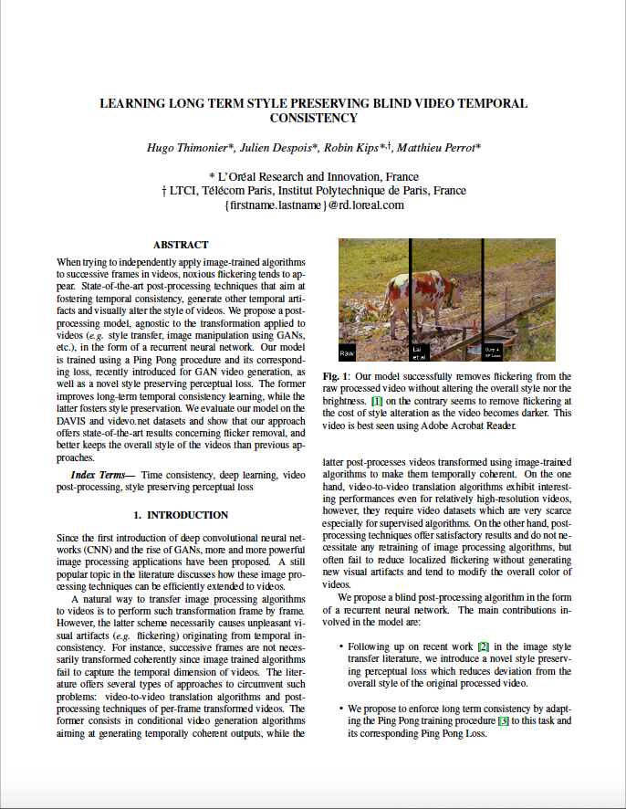

## Learning Long Term Style Preserving Blind Video Temporal Consistency

    <h2><a style="width: 25%;margin: 5%;" href="https://www.linkedin.com/in/hugo-thimonier-65949ba6/" target="_blank">Hugo Thimonier</a>
    	<a style="width: 25%;margin: 5%;" href="https://www.linkedin.com/in/juliendespois/" target="_blank">Julien Despois</a>
    	<a style="width: 25%;margin: 5%;" href="https://www.linkedin.com/in/robin-kips/" target="_blank">Robin Kips</a>
    	<a style="width: 25%;margin: 5%;" href="https://www.linkedin.com/in/matthieu-perrot-225ab01b/" target="_blank">Matthieu Perrot</a></h2>

  

## Abstract
When trying to independently apply image-trained algorithms to successive frames in videos, noxious flickering tends to ap- pear. State-of-the-art post-processing techniques that aim at fostering temporal consistency, generate other temporal arti- facts and visually alter the style of videos. We propose a post- processing model, agnostic to the transformation applied to videos (e.g. style transfer, image manipulation using GANs, etc.), in the form of a recurrent neural network. Our model is trained using a Ping Pong procedure and its correspond- ing loss, recently introduced for GAN video generation, as well as a novel style preserving perceptual loss. The former improves long-term temporal consistency learning, while the latter fosters style preservation. We evaluate our model on the DAVIS and videvo.net datasets and show that our approach offers state-of-the-art results concerning flicker removal, and better keeps the overall style of the videos than previous ap- proaches.

### Paper & Supplementary Materials

    
     
        
    

    

        

            H. Thimonier, J. Despois, R. Kips, M. Perrot 
            
                <b>Learning Long Term Style Preserving Bling Video Temporal Consistency.</b>
            
             
            ICME, 2021 (Main Conference, Oral)
            <a href="https://arxiv.org/abs/2008.10960" target="_blank">[arXiv]</a>&nbsp;<a href="bibtex.txt" target="_blank">[BibTeX]</a>&nbsp;<a href="supplementary_materials.zip" target="_blank">[Supplementary Materials]</a>
        

    

## Model
Let us denote the original unprocessed frames *{It}t=1,...T*, the per-frame processed videos *{Pt}t=1,...T*
and *{Ot}t=1,...T* the corresponding outputs of the model. Our model receives as input two sequences of frames of fixed length *k*, *\{It,It+1,...,It+k\}* the original unprocessed frames and *\{Pt,Pt+1,...,Pt+k\}* the processed frames using any transformation algorithms (<it>e.g.</it> Artistic style transfer...etc). Both sequences are transformed to form <it> Ping Pong</it> sequences of length *2k-1* as *\{It,...,It+k,...,It\}* and *\{Pt,...,Pt+k,...,Pt\}*. Our model processes the frames sequentially : to output *Ot*, the network takes as an input *It*, *It-1*, *Pt* and *Ot-1*. The deep network is comprised of a classical encoder-decoder architecture. The encoder part is composed of two downsampling strided convolutional layers, each followed by Instance Normalization. The encoder is then followed by 5 residual blocks and a ConvLSTM module. The decoder placed after the ConvLSTM module is composed of two transposed convolutional layers also followed by Instance Normalization.
We also include skip-connections via concatenation from the encoder to the decoder.

## Training
To train our model, we use two types of losses composed of six different losses: (i) Perceptual Losses : *Lp* to ensure perceptual resemblence between the input and output frames, *LSP*for style preservation, (ii) Temporal Losses : *LPP* and *Lrank*for both short term and long term temporal consistency, *Lst* for short-term temporal consistency and *Llt* for long-term temporal consistency.

  

## Results
### Videvo.net and DAVIS datasets
The height of each video in the training set is scaled to 480 while preserving the aspect ratio. The training set contains in total 25,735 frames. The applications considered in the dataset are the following: artistic style transfer, Colorization, Image enhancement, Intrinsic image decomposition, and Image-to-image translation.

The videos below display test set videos comparison between raw processed videos vs our post-processed model, but also our postprocessing model vs Lai et al. (2018) postprocessing model.

    <video style="margin: 0 auto; width: 49%" controls>
      <source src="img/cows_our_SPLoss_vs_ECCV18_CycleGAN_vangogh.MOV">
    Your browser does not support the video tag.
    </video>
    <video style="margin: 0 auto; width: 49%" controls>
      <source src="img/cows_our_SPLoss_vs_raw_CycleGAN_vangogh.MOV">
    Your browser does not support the video tag.
    </video>
    <video style="margin: 0 auto; width: 49%" controls>
      <source src="img/Koala_ours_vs_lai_WCT.MOV">
    Your browser does not support the video tag.
    </video>
    <video style="margin: 0 auto; width: 49%" controls>
      <source src="img/Pigs_ours_vs_lai.MOV">
    Your browser does not support the video tag.
    </video>

### Ping Pong Loss
The use of the <b> Ping Pong Loss</b> allows to correct temporal artefacts appearing using the post-processing the model of Lai et al. (2018). For instance, the following video was processed using makeup synthesis (lipstick) and post-processed using Lai et al. (2018) which removes
the lip flickering but at the cost of a red trail following the lips as the head moves. Our model on the contrary manages to remove flickering without generating any trail.

    <video style="margin: 0 auto; width: 98%" controls>
      <source src="img/P13_Ours_vs_Lai_et_al.MOV">
    Your browser does not support the video tag.
    </video>

### Style Preserving Perceptual Loss
The style preserving perceptual loss reduces deterioration of the brightness throughout videos and style deviation. For instance, both our model and the model of Lai et al. (2018) can alter the brightness of videos and our proposed loss manages to reduce such issue as seen in the following video.

    <video style="margin: 0 auto; width: 49%" controls>
      <source src="img/couple_SP_loss.MOV">
    Your browser does not support the video tag.
    </video>
    <video style="margin: 0 auto; width: 49%" controls>
      <source src="img/Cycling_our_stylematch_vs_ours_WCT_asheville.MOV">
    Your browser does not support the video tag.
    </video>

### Other works
Check out our other paper presented at AIM (ECCV 2020): <a href="https://github.com/despoisj/AgingMapGAN" target="_blank">https://github.com/despoisj/AgingMapGAN</a>
Check out our other paper presented at AIM (ECCV 2020): <a href="https://robinkips.github.io/CA-GAN/" target="_blank">https://robinkips.github.io/CA-GAN/</a>
